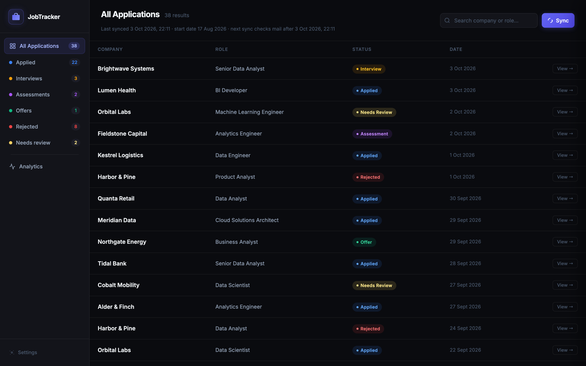
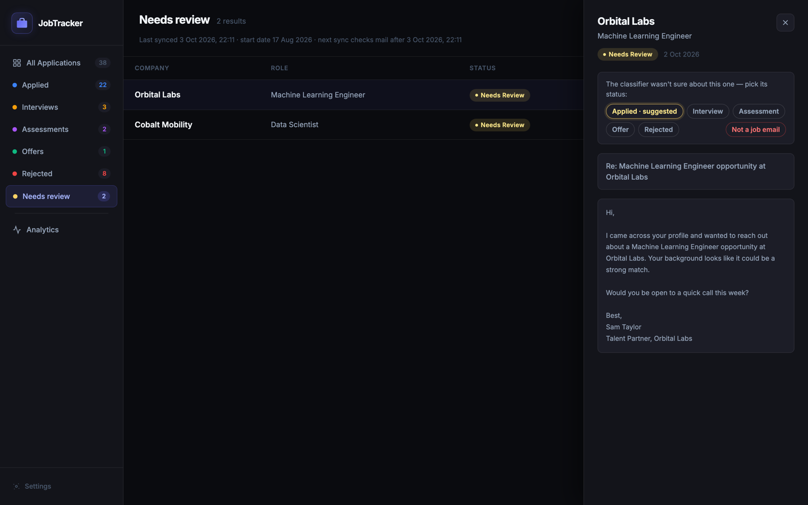
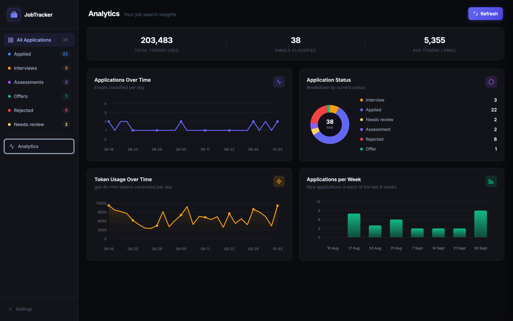
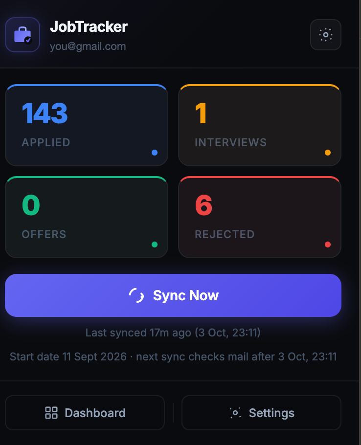
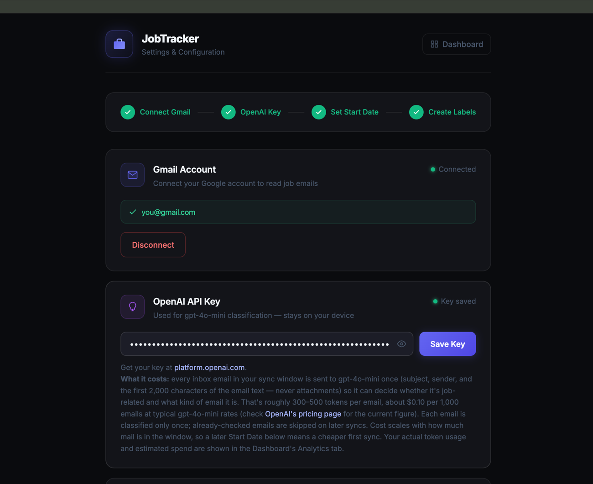
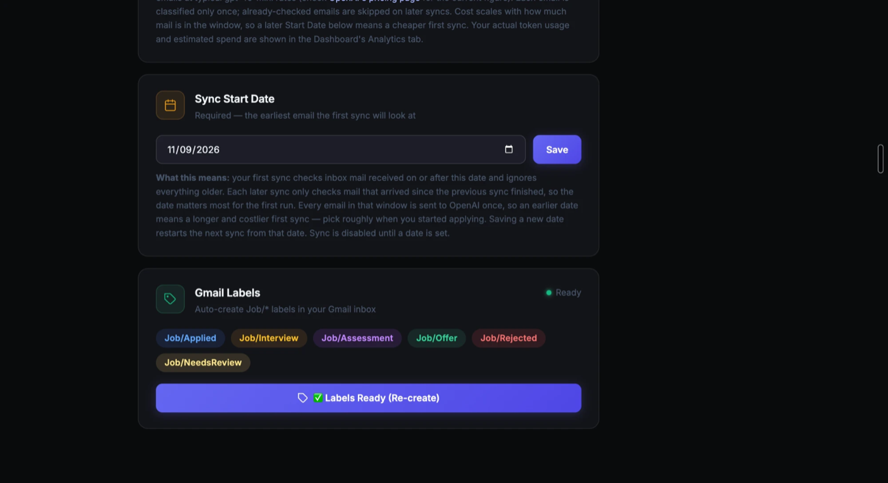
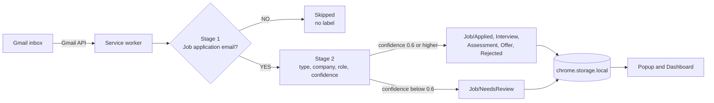

# JobLens

**See your whole job search through your inbox.** An AI-powered Chrome extension that finds your job-application emails in Gmail, sorts them by stage, and keeps a private dashboard — with no server and no spreadsheet.

> The extension currently appears as **JobTracker** in the browser and on the Chrome Web Store.


---

## Overview

Job hunting buries you in automated email: application receipts, interview invitations, assessments, rejections, and a constant stream of job-alert noise. JobLens answers one question — *where does every application stand?* — without you maintaining a tracker by hand.

Once you connect Gmail and an OpenAI key, it reads your inbox from a start date you choose and decides, email by email, whether it is part of a job application you are actually involved in. Real application emails are filed into colour-coded `Job/*` labels in Gmail and shown in a dashboard with search, filters, and analytics. Everything else — newsletters, job alerts, "new jobs posted" digests, security notices — is left completely untouched.

There is no backend. The extension runs in your browser, stores its data in `chrome.storage.local`, and talks only to Google (Gmail API) and OpenAI, using an API key that you supply.

**Status:** invite-only beta (unlisted Chrome Web Store listing; Google OAuth in testing mode).

---

## Screenshots

> The dashboard, review queue and analytics screenshots use **sample data with fictional companies** (not real inbox data). The popup and settings screenshots come from a real install with the account email masked.

### Dashboard



### Needs-review queue

When the classifier is not sure, it does not guess. The email is parked under **Needs review** with its best-guess status highlighted, and you decide in one click — the Gmail label is swapped to match.



### Analytics



### Popup and setup

| Popup | Settings |
|:---:|:---:|
|  |  |



---

## Features

### Smart inbox classification
- **Two-stage pipeline.** A fast yes/no check ("is this part of a job application I'm involved in?") filters out noise using the subject, sender and start of the email. Only emails that pass go to a second, more detailed step that works out the *type* of email, the company, the role, and a confidence score.
- **Understands the difference** between an automated application receipt (a real application) and a job-board digest or "review this company" nag (not one), including receipts from applicant tracking systems and Indeed Apply.
- **Politely-worded rejections** ("we've decided to pursue other candidates", "wish you well", "keep your details on file") are recognised as rejections.

### Gmail labels that stay in sync
- Six colour-coded labels: `Job/Applied`, `Job/Interview`, `Job/Assessment`, `Job/Offer`, `Job/Rejected`, `Job/NeedsReview`.
- Non-job emails get **no label at all**.
- Change a status in the dashboard and the Gmail label is swapped to match; remove a label in Gmail and the dashboard follows on the next sync.

### Needs-review queue
- Low-confidence results are never filed on a guess. They wait in a **Needs review** list with the classifier's suggestion pre-highlighted.
- One-click **status picker** and a **Not a job email** button that clears the label and remembers the email so it is never checked (or paid for) again.

### Dashboard and analytics
- Searchable application table with per-status filters and live counts.
- Detail panel with the full email text.
- Analytics tab: applications over time, status breakdown, applications per week, and token usage per day.

### A sync engine built to be re-run safely
- **Incremental.** Each sync only looks at mail received since the previous successful sync.
- **Resumable.** Progress is saved as it goes; closing the browser or pressing **Stop** mid-sync loses nothing already classified.
- **Live everywhere.** A sync started in the popup shows its progress in every open dashboard tab, and vice versa.
- **Cheap.** Every email is classified once; ones already judged are cached and skipped.

### Guided setup and honest errors
- Syncing stays disabled until all four setup steps (Gmail, OpenAI key, start date, labels) are complete, and the popup and dashboard list what is missing.
- When Google's 7-day sign-in expiry hits (testing-mode OAuth), the extension says exactly what happened and how to reconnect — and your data is untouched.

---

## How it works



1. The service worker lists inbox mail received after the last checkpoint, using an exact Unix-timestamp query.
2. **Stage 1** asks gpt-4o-mini a yes/no question. A "no" ends the story: no label, no record, never re-checked.
3. **Stage 2** extracts structured data as JSON. Only types that mean "I applied" or "my application moved" become applications; job alerts and generic outreach are dropped.
4. The result is labelled in Gmail, saved locally, and pushed to any open popup or dashboard through `chrome.storage` change events.

| Email type | Becomes |
|---|---|
| Application received / confirmation | `Job/Applied` |
| Interview invitation, "moving forward" updates | `Job/Interview` |
| Test or online assessment | `Job/Assessment` |
| Offer | `Job/Offer` |
| Rejection | `Job/Rejected` |
| Job alert, digest, newsletter, review request | *ignored* |
| Job-related but the model is unsure | `Job/NeedsReview` |

---

## Tech stack

| Layer | Technology |
|---|---|
| Platform | Chrome Extension, Manifest V3 (service worker, action popup, extension pages) |
| Language | TypeScript (strict mode) |
| Build | esbuild (bundling, minification, production packaging) |
| Email | Gmail REST API with OAuth 2.0 via `chrome.identity` (`gmail.modify`) |
| AI | OpenAI Chat Completions, `gpt-4o-mini`, JSON mode, temperature 0 |
| Storage | `chrome.storage.local` — no database, no server |
| UI | Vanilla HTML and CSS; charts are hand-drawn on `<canvas>` (no framework, no chart library) |

About 2,700 lines of TypeScript and no runtime dependencies.

---

## Engineering highlights

- **MV3 service-worker lifecycle.** The worker can be killed at any moment, so sync progress is published to `chrome.storage`; every popup and dashboard tab mirrors it through change events, and stale "running" state is reset when a fresh worker starts.
- **Exact sync boundaries.** Gmail's date operators are day-granular and timezone-dependent, which caused emails from the wrong day to leak in. The query uses Unix timestamps and every message is re-validated against the cutoff locally.
- **Prompt evaluation, not vibes.** A small test harness (`npm run test:classify`) runs the real classifier against realistic emails. It caught a prompt that rejected genuine application receipts for being "automated", and confirms job-board digests are rejected.
- **Safe to re-run.** A cache of already-judged emails, a classifier version number that triggers a re-scan when the logic changes, and reconciliation with the labels you set by hand.
- **Least privilege.** Two permissions (`identity`, `storage`), one OAuth scope, two host permissions, no remote code, no web-accessible resources, and all email-derived text is HTML-escaped before rendering.
- **Graceful OAuth limits.** Google's 7-day testing-mode token expiry is detected specifically (not confused with being offline) and surfaced with a clear reconnect path.

---

## Getting started

### Prerequisites
- Google Chrome
- Node.js 18+
- A Google account (Gmail)
- An [OpenAI API key](https://platform.openai.com/api-keys)

### Install and build

```bash
git clone https://github.com/niksom406/job_tracker_extension.git
cd job_tracker_extension
npm install
npm run build
```

### Connect Google and load the extension

Reading Gmail requires your own Google Cloud OAuth client (about 10 minutes, one time). The full walkthrough is in **[SETUP.md](./SETUP.md)**. In short:

1. Create a Google Cloud project, enable the **Gmail API**, and configure the OAuth consent screen with the `gmail.modify` scope and yourself as a test user.
2. Load the extension: `chrome://extensions` → **Developer mode** → **Load unpacked** → select this folder.
3. Create an OAuth client of type **Chrome Extension** using the extension's ID, and put its client ID in `manifest.json`.
4. Open the extension's **Settings** and complete the four steps: connect Gmail, add your OpenAI key, pick a start date, create the labels.
5. Click **Sync Now**.

### Scripts

| Command | What it does |
|---|---|
| `npm run build` | Development build into `dist/` |
| `npm run dev` | Rebuild on file changes |
| `npm run build:prod` | Minified build with no source maps |
| `npm run package` | Production build plus a store-ready `jobtracker.zip` |
| `npm run test:classify` | Run the classifier against sample emails (needs `OPENAI_API_KEY`) |

---

## Cost

Calling OpenAI is the only running cost: roughly **$0.10–0.15 per 1,000 emails** with `gpt-4o-mini`. Every email is checked once, and emails that are clearly not job-related stop after a tiny yes/no call. Token usage is tracked on the Analytics tab, and a later start date makes the first sync cheaper.

---

## Privacy and security

- **No server, no analytics, no tracking.** Nothing is sent to the developer.
- Application data, settings and your OpenAI key live in `chrome.storage.local`, on your device.
- Google sign-in is handled by Chrome's identity API; the access token is never stored by the extension.
- OpenAI receives only an email's **subject, sender and the first 2,000 characters of its text** — never attachments.
- Gmail access is limited to reading mail and adding or removing the extension's own labels. It never sends, deletes or archives anything.

Use a dedicated OpenAI key with a monthly spend limit. Full details are in [PRIVACY.md](./PRIVACY.md).

---

## Project structure

```text
.
├── manifest.json            # MV3 manifest, permissions, OAuth scope
├── build.js                 # esbuild config (dev, watch, production)
├── src/
│   ├── background.ts        # service worker: auth, sync engine, message router
│   ├── popup.{html,css,ts}  # toolbar popup: counts, sync, live progress
│   ├── dashboard.{html,css,ts}  # table, review queue, detail panel, analytics
│   ├── settings.{html,css,ts}   # guided four-step setup
│   └── lib/
│       ├── gmail.ts         # Gmail REST client and message parsing
│       ├── openai.ts        # two-stage classifier prompts
│       ├── labels.ts        # Job/* label definitions and bootstrap
│       ├── storage.ts       # chrome.storage helpers
│       ├── setup.ts         # setup-completeness checks
│       └── types.ts         # shared types and message contracts
├── scripts/                 # classifier test harness, screenshot helper
├── assets/                  # icons and Chrome Web Store assets
├── docs/screenshots/        # README images
├── SETUP.md                 # Google Cloud and installation walkthrough
└── PRIVACY.md               # privacy policy
```

---

## Roadmap

- **Group emails by application** — match a rejection or interview invite to the application it belongs to, so one role is one row that moves through stages (today each email is its own row).
- **Public release** — Google's OAuth verification and security assessment for the restricted Gmail scope.
- Export to CSV, and reminders for applications that have gone quiet.

---

## Author

Built by **Nikita Somani** — [@niksom406](https://github.com/niksom406)

## License

Released under the [MIT License](./LICENSE).
